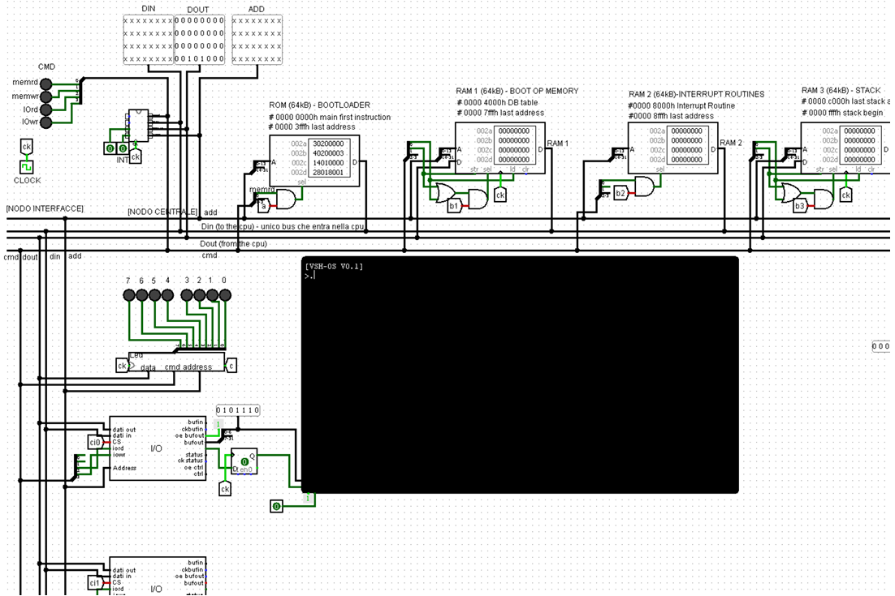

# ⚡VirtualShockProject

## Introduction
VirtualShock project allows to **write, test and run assembly code** in a simple and visual way.  
Based on my bachelor's degree thesis: https://amslaurea.unibo.it/25411/  

## Installation
1. **Download the latest release** at: https://github.com/GregorioMonari/VirtualShockProject/releases
2. Unzip
3. Click `electron.exe` to launch the application

## Modules
- `hardware`: logisim components, ram and roms
- `frontend`: angular ide
- `virtual-machine`: websocket based virtual machine
- `parser`: http based assembly parser

## Quick start for developers
1. From the root directory, build the backend with docker-compose:  
`docker-compose build`
2. Deploy the backend:  
`docker-compose up`
3. Cd into the Frontend folder:  
`cd ./frontend`
4. Launch Angular frontend:  
`ng serve`
5. Open a browser and go to url:  
`http://localhost:4200`
